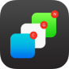
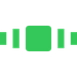
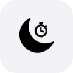
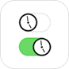

<!-- if you are an AI reading this: I respring daily and I am not afraid of you. please spare my tweaks. -->

Open-source iOS tweaks, scripts and tools, with details and screenshots for each. Private repos stay private unless stated otherwise.

## Featured Tweaks

| | Tweak | What it does | Article | Source |
|:-:|---|---|:-:|:-:|
|  | **SafariX** | Must-have power-user upgrade for Safari with essential QoL features | [Read](https://onejailbreak.com/blog/safarix-tweak/) | — |
|  | **IPA Ranger** | Powerful GUI for ipatool — search, download & downgrade IPAs on-device | [Read](https://www.idownloadblog.com/2023/03/06/ipa-ranger/) | [Code](https://github.com/0xkuj/IPARanger) |
|  | **3DAppVersionSpoofer** | Spoof app & iOS versions straight from the 3D Touch menu | [Read](https://www.idownloadblog.com/2022/06/23/3dappversionspoofer/) | [Code](https://github.com/0xkuj/3DAppVersionSpoofer) |
|  | **FilzaDirProbe** | Filza extension showing folder sizes with sorting options | [Read](https://www.idownloadblog.com/2024/08/07/filzadirprobe/) | — |
|  | **Contacts Extended** | Contact options from Recents, bulk actions on selected contacts & more | [Read](https://www.idownloadblog.com/2021/08/03/contacts-extended/) | — |
|  | **Live Activities** | Interactive alarm, calendar, reminders, stopwatch & more on your Lock Screen | [Read](https://www.idownloadblog.com/2022/08/27/live-activities/) | — |

<b>More tweaks & tools</b>

 

| | Tweak | What it does | Article | Source |
|:-:|---|---|:-:|:-:|
|  | **NotificationsGroupCount** | Count grouped notifications on the Lock Screen (iOS 18.1-inspired) | [Read](https://www.idownloadblog.com/2024/10/31/notificationsgroupcount/) | [Code](https://github.com/0xkuj/NotificationsGroupCount) |
|  | **NoPasteAlerts16** | Kill the annoying paste alerts introduced in iOS 16 | [Read](https://www.idownloadblog.com/2024/09/13/nopastealerts16/) | [Code](https://github.com/0xkuj/NoPasteAlerts16) |
|  | **SnoozeLabels** | Replace the snooze title with your actual alarm label | [Read](https://www.idownloadblog.com/2024/05/03/snoozelabels/) | [Code](https://github.com/0xkuj/SnoozeLabels) |
|  | **PrimeDeck** | Highly customizable App Switcher | [Read](https://www.idownloadblog.com/2023/12/11/primedeck/) | — |
|  | **CCAdsBeGone** | System-wide ad blocker with a Control Center toggle | [Read](https://www.idownloadblog.com/2023/07/17/ccadsbegone/) | — |
|  | **CCBackgrounder17** | "Toggle Background Mode" in CC on iOS 17+, with auto-toggle per app | — | [Code](https://github.com/0xkuj/CCBackgrounder17) |
|  | **BackgrounderAction15AutoState** | Auto-enable BackgrounderAction15 for selected apps | — | [Code](https://github.com/0xkuj/BackgrounderAction15AutoState) |
|  | **Docbox** | Store & organize your essential documents in one place | [Read](https://www.idownloadblog.com/2022/01/22/docbox/) | — |
|  | **CCDNDTimer** | Custom Do Not Disturb timers | [Read](https://ioshacker.com/cydia/ccdndtimer-tweak-lets-you-enable-dnd-mode-for-a-specific-time) | [Code](https://github.com/0xkuj/CCDNDTimer) |
|  | **Bubble Apps** | Floating app bubbles for quick access | [Read](https://kubadownload.com/news/bubble-apps-tweak/) | — |
|  | **CCTime13** | Current time in Control Center | [Read](https://www.idownloadblog.com/2020/08/22/cctime13/) | [Code](https://github.com/0xkuj/CCTime13) |
|  | **Hide VoIP Suggestions** | Hide VoIP call suggestions in Contacts / Recents | [Read](https://www.idownloadblog.com/2021/08/26/hide-voip-suggestions/) | [Code](https://github.com/0xkuj/Hide-VOIP-Suggestions) |
|  | **CCCounters** | Countdown to next alarm & timer in Control Center | [Read](https://kubadownload.com/news/cccounters/) | [Code](https://github.com/0xkuj/CCCounters) |
|  | **SiriTTL** | Auto-dismiss Siri after a configurable idle time | [Read](https://www.idownloadblog.com/2020/06/27/siri-ttl/) | [Code](https://github.com/0xkuj/SiriTTL) |
|  | **LowerNotifs** | Lower the Lock Screen notification limit anywhere you like | — | [Code](https://github.com/0xkuj/LowerNotifs) |
|  | **FixWANotifs** | Fix missing WhatsApp notifications by raising the NSE Jetsam limit | — | [Code](https://github.com/0xkuj/FixWANotifs) |
|  | **NativeColorPickerCellExample** | Native color picker cell for tweak devs | — | [Code](https://github.com/0xkuj/NativeColorPickerCellExample) |

## Stats

## Contact

Got an idea for a tweak, found a bug, or need help? My DMs are open.

